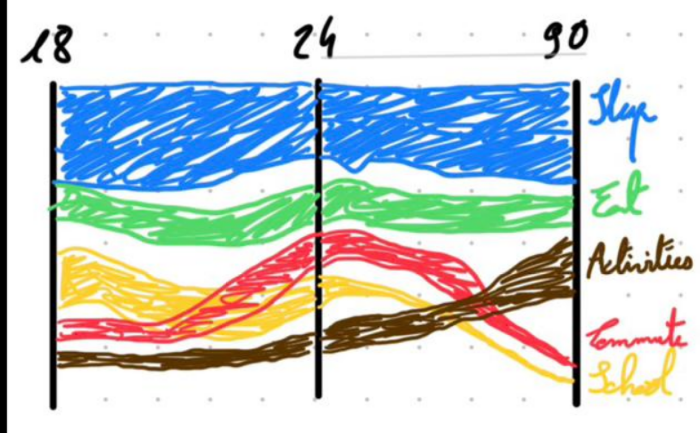

# Design
## Notes
- Keep same color for the same category across all charts
- Use a color palette that is colorblind-friendly and has good contrast for better readability
- Specify that it's the whole of Europe
- Observation: a lot of CSV files are missing the age field (but may have the category)
- Observation: unifiedacl has some empty values because some don't csv don't have the category field

## Layout
At the top of the page, there is a title that describes the visualization. Below the title, there is a brief description of what the visualization shows and how to interpret it.  

Then a Area Bump Chart of categories partition for each age group. The age groups can be selected from tabs/slider/idk, and the categories are colored differently. The years are the y-lines on the chart. It should start with 2000 and have steps for each year present in the data. Below the charts, there is a legend that explains the colors of the categories. When a category becomes more important than the one before it, it should go up in the order so that for each year you have the order of the categories from the most important to the least important. The width of the lines should be proportional to the percentage of time spent on that category for that age group and year. The lines should be smooth and visually appealing, and there should be a clear separation between the different categories. There should also be a small description below the chart that explains any notable trends or changes in the categories over time.    

⚠️ Make sure that the smallest categories are visibles vs Sleep, eating etc  

After that a detail line chart for each category, showing the trend over time for each age group. You can select the category using a button list, and the line chart updates to show the selected category. The x-axis of the line chart represents the years, and the y-axis represents the percentage of time spent on that category. Each age group is represented by a different colored line, and there is a legend to explain the colors. The labels for each group are placed at the end of the lines for easy identification. There is also a small description below the line chart that explains the trends and any notable changes over time. Maybe we can add a separator between the categories for which we observed a interesting trend.    

Latest, in another section is a waffle chart for the time repartition between alone/shared/other for each year. The age group can be selected using a "tab list of age groups" below the chart, and the chart updates to show the selected age group. The x-axis of the chart represents the years, and the y-axis represents the percentage of time spent alone/shared/other. The share of time should be always shown as a percentage to be easily identifiable.  

## Data choices
### Age groups
**Decision:**  
- 10-24 (ACL10: Y15-20, Y20-24; ACL18: Y10-14, Y15-24) + Y15-29 (we loose some accuracy but there is only 4000 datapoints, so not skeewing it a lot with 24+)
- 25-44 (ACL10: Y25-44; ACL18: Y25-34, Y30-44, Y35-44)
- 45-64 (ACL10: Y45-64; ACL18: Y45-54, Y45-64, Y55-64)
- 65+ (ACL10: Y65-74, Y_GE65; ACL18: Y65-74, Y_GE65, Y_GE75), we can't have a 75+ category because there is no 75+ category in ACL10, but we can have a 65+ category that includes the 75+ in ACL18.   

We checked and the values in all of the age categories are unique.  
However, we choose to discard these categories since we couldn't find a way to fit them in the groups we defined above:  
- TOTAL
- Y20-74 from ACL10 with 21510 rows
- Y15-64 from ACL18 with 3780 rows
- Y30-64 from ACL18 with 3780 rows
- Y_GE60 from ACL18 with 3780 rows

### Categories
Catégories très larges :  
- Personal care/rest → AC01, AC02/AC021
- Work → AC1_2
- Domestic/family → AC321, AC382_383
- Leisure/media → AC72, AC812
- Social life → AC512_513_519, AC52
- Walking → AC611
- Commuting → AC910

| Code          | Description                                         | N rows | Commentaire                                                                      |
| ------------- | --------------------------------------------------- | ------ | -------------------------------------------------------------------------------- |
| AC01          | Sleeping                                            | 24 918 | _Stable_                                                                         |
| AC02 + AC021  | Eating                                              | 57 312 | _Stable_                                                                         |
| AC812         | Reading books                                       | 24 918 | Montre une baisse progressive de la lecture de livres.                           |
| AC72          | Computing                                           | 26 925 | Très bon signal "modernité numérique", souvent différenciant selon âge/année.    |
| AC512_513_519 | Socialising with others (visits, celebrations etc)  | 35 979 | Signal social plus robuste que AC519 seul, disponible sur les trois vagues.      |
| AC52          | Entertainment and culture                           | 24 918 | Bon proxy de loisirs hors numérique, lisible sur l’ensemble des années.          |
| AC611         | Walking and hiking                                  | 24 918 | Indicateur utile de mobilité douce et de loisirs actifs selon âge/période.       |
| AC321         | Cleaning dwelling                                   | 25 926 | _Activité domestique concrète, utile pour contraste avec loisirs/travail._       |
| AC382_383     | Teaching, reading, playing and talking with child   | 24 918 | Très pertinent pour une lecture "temps partagé/familial".                        |
| AC1_2         | Employment and study                                | 21 315 | Remplace AC111 par un bloc stable sur les trois années pour structurer le récit. |
| AC910         | Travel to/from work                                 | 24 918 | Très utile avec AC1_2 pour analyser l’effet mobilité/emploi.                     |

In _underline_ the categories that will be excluded from the detailed line chart because they are not interesting to analyze in detail (sleep, eating, etc).  

Catégories à éviter ou mettre en "Autres" :  
- Agrégats trop larges : AC4-8_998_X_713, AC3_713_*, AC9, etc.
- Codes peu interprétables / non spécifiés : AC900, AC998, AC999, vide
- Codes techniques productifs : AC_NP_*, AC_PNP_*

### Alone and shared time
- Alone: Computing (AC72), Cleaning dwelling (AC321), Travel to/from work (AC910)
- Shared: Socialising with others (AC512_513_519), Entertainment and culture (AC52), Teaching, reading, playing and talking with child (AC382_383), AC1_2 (Employment and study), Walking and hiking (AC611)

## Interactivity

